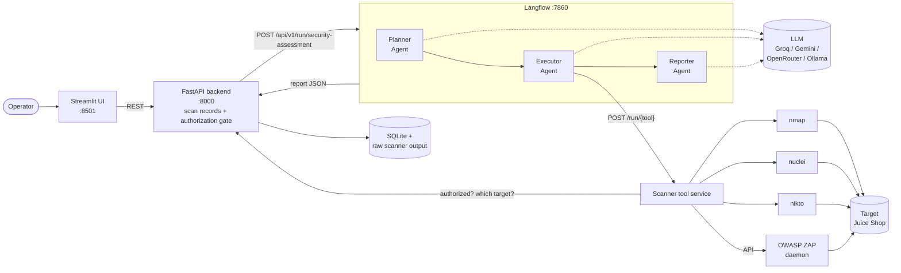

# Agentic Security Assessment Platform

**A small multi-agent system that plans a basic security assessment of a web target, runs open-source scanners, and writes a findings report.** Three agents built in Langflow (Planner, Executor, Reporter) drive nmap, OWASP ZAP, Nuclei and Nikto. A FastAPI backend holds the scan records and the authorization gate; a Streamlit page is the UI. One `docker compose up` starts everything, including a deliberately vulnerable target to try it on.

[](https://python.org)
[](https://www.langflow.org/)
[](LICENSE)

> ### ⚠️ Authorization notice
> Scan only what you own or are authorized **in writing** to test. Scanning someone else's system without permission is illegal in most countries.
> The platform refuses to run until the operator ticks a confirmation box, and it stores that confirmation (who, when, the exact statement) with the scan record. **No tick, no scan.**
> It does detection and reporting only. It contains no exploitation tooling.

---

## What it does

1. You enter a target URL, optional scope notes, and tick the authorization box.
2. The **Planner** agent reads the target and scope and chooses which scanners to run.
3. The **Executor** agent runs them through tool calling and collects their structured output.
4. The **Reporter** agent maps each finding to a CVSS severity band, adds remediation guidance and writes the report.
5. You read the report in the browser or download it as PDF, Markdown or JSON.

A full run against the bundled OWASP Juice Shop takes about five and a half minutes. The run saved in [`docs/sample-report/`](docs/sample-report/) used all four tools and produced 33 findings (5 Medium, 13 Low, 15 Info): [PDF](docs/sample-report/report.pdf) · [Markdown](docs/sample-report/report.md) · [JSON](docs/sample-report/report.json).

| Tool | What it checks | Time on Juice Shop | Findings |
|---|---|---:|---:|
| nmap | Open ports and services (top 100 TCP ports) | 11 s | 1 |
| OWASP ZAP | Baseline: spider + AJAX spider + passive rules | 57 s | 9 |
| Nuclei | Technology, misconfiguration, exposure and panel templates | 131 s | 13 |
| Nikto | Web server checks, time-boxed to 120 s | 123 s | 10 |

## Architecture



Six containers: `juice-shop` (demo target), `zap`, `scanners` (nmap + Nuclei + Nikto behind a small HTTP API), `langflow`, `backend`, `frontend`.

### The three agents

The flow is five nodes in a line. Open http://localhost:7860 to see and edit it; each agent's instructions are an editable field on its node.

```
Chat Input → Planner Agent → Executor Agent → Reporter Agent → Chat Output
```

| Agent | Reads | Does | LLM's part |
|---|---|---|---|
| **Planner** | Target, scope notes, tool catalog | Produces an ordered list of tools with a reason for each. Scope notes are binding: "no port scanning" removes nmap. | Chooses the tools |
| **Executor** | The plan | Runs each planned scanner as a tool call, reads the result summary, continues or stops. | Drives the tool-calling loop |
| **Reporter** | Raw findings from every tool | Rates each finding, attaches remediation guidance, writes the executive summary. | Writes the summary and the fix advice |

The design follows the split used by PentestGPT (reasoning, generation, parsing) and later multi-agent projects such as PentAGI: one agent keeps the plan, one acts, one condenses tool output. See [`docs/research-notes.md`](docs/research-notes.md).

### How findings stay tied to tool output

The rule for this project is that the report never contains a vulnerability a scanner did not report. Four things enforce it:

- **Findings are copied by code, not retyped by the model.** The Reporter's LLM sees a short list (ID, tool, title, severity) and returns text keyed by finding ID. That text is attached to the existing findings. An ID that does not exist is dropped.
- **Every finding carries its evidence and its source file.** The untouched scanner output (`nmap.xml`, `zap.json`, `nuclei.jsonl`, `nikto.json`) is kept per scan and served at `GET /api/scans/{id}/raw/{file}`.
- **Severity comes from the scanner.** A CVSS score reported by the tool is used as is. Otherwise the tool's own rating is mapped to the CVSS band of the same name. Each finding says which of the two applied. The model never assigns a score.
- **A CVE in the summary that no scanner reported discards the summary.**

The report marks which text is from a scanner and which is AI-written.

### How the authorization gate works

| Layer | Check |
|---|---|
| UI | The run button is disabled until the box is ticked. |
| Backend | `POST /api/scans/{id}/start` returns 403 unless `/authorize` was called with `confirmed: true`. The confirmation is stored on the scan row: who, when, and the statement they agreed to. |
| Scanner service | Before every tool run it asks the backend whether that scan is authorized, and takes the target from that record. An unauthorized scan ID gets 403. |

Because the scanner service reads the target from the authorized record, the Executor's tool calls carry no target argument. The LLM cannot point a scanner at a different host, whatever a web page or a banner tells it.

## Quick start

Requirements: Docker Desktop (or Docker Engine with Compose v2) with at least 8 GB of memory, and an API key for an LLM provider. Groq's free tier is the default.

```bash
git clone https://github.com/MohanVishe/agentic-security-assessment.git
cd agentic-security-assessment
cp .env.example .env
```

Put your key in `.env` (`LLM_API_KEY=...`), then:

```bash
docker compose up --build
```

The first build pulls several large images (about 9 GB on disk; ZAP and Langflow are the big ones) and the Nuclei templates. When it settles:

| | URL |
|---|---|
| **UI** | http://localhost:8501 |
| API docs | http://localhost:8000/docs |
| Langflow canvas | http://localhost:7860 |
| Juice Shop (the demo target) | http://localhost:3001 |

In the UI, leave the target on **OWASP Juice Shop (local container)**, tick the authorization box and press **Run assessment**. Status lines from each agent appear as they work.

### Demo targets

| Target | URL to enter | Notes |
|---|---|---|
| OWASP Juice Shop | `http://juice-shop:3000` | Runs locally in the stack. The default. |
| Acunetix test site | `http://testphp.vulnweb.com` | Public site published for testing scanners. |

For anything else, pick **Custom URL**. The scanners run inside containers, so a `localhost` URL is rewritten to `host.docker.internal` to reach an app on your machine.

### Choosing the LLM

Any OpenAI-compatible chat endpoint with tool calling works. Change three values in `.env`:

| Provider | `LLM_BASE_URL` | `LLM_MODEL` (example) |
|---|---|---|
| Groq (default) | `https://api.groq.com/openai/v1` | `openai/gpt-oss-120b` or `qwen/qwen3.8-27b` |
| Google Gemini | `https://generativelanguage.googleapis.com/v1beta/openai/` | a current Flash model |
| OpenRouter | `https://openrouter.ai/api/v1` | any tool-calling model |
| Ollama (local, no key) | `http://host.docker.internal:11434/v1` | `qwen2.5:7b-instruct` |

Set the `LLM_FALLBACK_*` values to name a second provider. It is used when the first is rate limited or down. The sample report in this repo was produced with `qwen2.5:7b-instruct` on Ollama.

A run makes about seven LLM calls (one Planner, about five Executor, one Reporter). Prompts are kept small on purpose: the agents see summaries and titles, never full scanner output, so a run fits Groq's free limits of 30 requests and 8,000 tokens per minute.

## API

```bash
# 1. submit a target
curl -X POST localhost:8000/api/scans -H 'Content-Type: application/json' \
  -d '{"target_url": "http://juice-shop:3000", "scope_notes": "Web checks only, no port scanning."}'

# 2. confirm authorization (stored with the scan record)
curl -X POST localhost:8000/api/scans/$ID/authorize -H 'Content-Type: application/json' \
  -d '{"confirmed": true, "authorized_by": "Your Name"}'

# 3. start the assessment (background task; 403 without step 2)
curl -X POST localhost:8000/api/scans/$ID/start

# 4. poll status and live events
curl localhost:8000/api/scans/$ID

# 5. fetch the report
curl localhost:8000/api/scans/$ID/report          # JSON
curl localhost:8000/api/scans/$ID/report.md       # Markdown
curl -O localhost:8000/api/scans/$ID/report.pdf   # PDF
```

## Project layout

```
docker-compose.yml
scanners/                 tool service
  app.py                    POST /run/{tool}: authorization check, run, summarize
  tools/                    nmap.py, zap.py, nuclei.py, nikto.py (one wrapper each)
langflow/
  components/security_agents/   planner_agent.py, executor_agent.py, reporter_agent.py
  agentlib/agent_common.py      LLM call with retry and fallback, status events
  flows/security_assessment.json   the flow Langflow loads at startup
  build_flow.py                 regenerates that file from the components
backend/app/              main.py (API + gate), db.py (SQLite), report.py (Markdown + PDF)
frontend/app.py           Streamlit UI
docs/                     sample report, research notes
```

### Changing the agents

Prompts can be edited directly on the nodes in the Langflow canvas. To change component code, edit the files under `langflow/components/`, then rebuild the flow file (it embeds a copy of the code) and restart Langflow:

```bash
python langflow/build_flow.py
docker compose restart langflow
```

To add a scanner, add one module in `scanners/tools/` with a `SPEC` and a `run()` that returns the common finding shape, and list it in `tools/__init__.py`. The Planner reads the catalog from the tool service, so no prompt changes are needed.

### Tests

```bash
docker compose run --rm --no-deps -v ./scanners:/app scanners sh -c "pip install -q pytest && python -m pytest -q"
docker compose run --rm --no-deps -v ./backend:/srv  backend  sh -c "pip install -q pytest && python -m pytest -q"
```

The scanner tests feed each parser a sample of that tool's output format. The backend tests cover target validation and the authorization gate.

## Limitations

- **Authorization-gated.** Nothing runs without a recorded confirmation. The platform records who confirmed; it cannot verify that the claim is true. That responsibility stays with the operator.
- **Detection, not exploitation.** Findings are what the scanners flagged. Nothing is verified by exploiting it, so expect false positives and treat every finding as a lead to confirm.
- **Baseline depth.** ZAP runs the baseline (spider and passive rules), not an active scan. Nuclei runs four detection template folders. Both choices keep runs short and within free-tier LLM limits; they also mean injection flaws and logic bugs are out of reach.
- **The LLM is confined to tool output.** It plans, sequences and words the report. It cannot add findings or scores, which also means it will not notice anything the scanners missed.
- **Severity without a score is a band, not a calculation.** Only findings where the scanner supplies a CVSS score get one. Nikto does not rate findings, so they are listed as Low by default.
- **Free-tier rate limits.** A rate-limited call is retried, then sent to the fallback provider if one is set. If the Planner cannot reach any LLM the run stops, because guessing a plan could break the scope notes. If the Executor loses the LLM mid-run, the remaining approved steps run in plan order. If the Reporter loses it, the report ships with scanner findings and no AI text.
- **Scanner output can carry prompt injection.** Service banners and page content are attacker-controlled text. The agents see only short titles from it, the target is fixed outside the LLM, and only planned tools can be called, which limits what an injection can do. It is not a complete defence.
- **Test credentials are HTTP Basic only.** They are held in memory for the run and passed to ZAP, Nuclei and Nikto. Form and token logins are not handled.
- **One assessment at a time**, single user, SQLite. Langflow runs with auto-login. Ports bind to `127.0.0.1`; this is a local demo, not a hosted service.
- **Docker required**, with about 8 GB of memory for the stack. ZAP's headless browser is the heavy part and is capped at 3 GB.

## Future work

- **Exploitation and validation** of findings in a sandbox, behind a second explicit approval, so the report can separate confirmed issues from leads. Deliberately out of scope for this version.
- A human approval step between Planner and Executor, showing the plan before anything runs.
- Authenticated scanning with form and token logins (ZAP contexts), and a ZAP active-scan profile for targets where it is permitted.
- More tools: `testssl.sh` for TLS, a content discovery tool, dependency and container scanners.
- CVSS v4.0 vectors, and export to SARIF or CSAF so findings load into DefectDojo and similar trackers.
- A triage agent that cross-checks findings between tools and flags likely false positives.
- A job queue for concurrent assessments, user accounts, and a signed authorization record.

## License

MIT. See [LICENSE](LICENSE). The bundled scanners keep their own licenses: nmap (NPSL), OWASP ZAP (Apache 2.0), Nuclei (MIT), Nikto (GPL).
