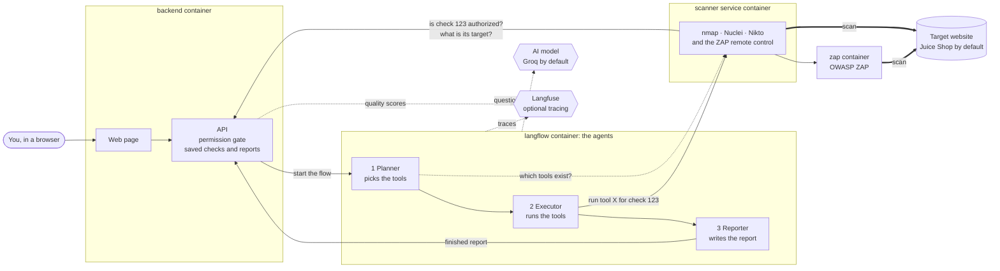

# Agentic Security Assessment

Three AI agents check a website for common security problems. They plan the check, run well-known open-source scanners, and write a report with the findings and how to fix them.

It **finds and reports** problems. It does not attack, exploit or break into anything.


**See it first:** [step-by-step demo with screenshots](docs/DEMO.md) · sample report as [Markdown](docs/sample-report/report.md), [PDF](docs/sample-report/report.pdf) or [JSON](docs/sample-report/report.json)

## Contents

1. [What this is, in plain words](#1-what-this-is-in-plain-words)
2. [Before you scan anything](#2-before-you-scan-anything)
3. [Quick start](#3-quick-start)
4. [How it works](#4-how-it-works)
5. [The parts, one by one](#5-the-parts-one-by-one)
6. [The three agents](#6-the-three-agents)
7. [The four scanner tools](#7-the-four-scanner-tools)
8. [The practice website: OWASP Juice Shop](#8-the-practice-website-owasp-juice-shop)
9. [Reading the report](#9-reading-the-report)
10. [How the report stays honest](#10-how-the-report-stays-honest)
11. [Tracing and evaluation](#11-tracing-and-evaluation)
12. [Choosing the AI model](#12-choosing-the-ai-model)
13. [Project layout](#13-project-layout)
14. [For developers](#14-for-developers)
15. [Limitations](#15-limitations)
16. [Future work](#16-future-work)

## 1. What this is, in plain words

**What is a security assessment?** Think of a home inspection. Someone walks around the house, tries the doors and windows, and writes down what looks unsafe: a lock that is missing, a window left open. A security assessment (people also say "penetration test" or "pentest") does the same for a website. A full pentest goes one step further and actually tries to break in. This project stops before that step: it looks, and it writes down what it sees.

**What does this project do?**

1. You give it a website address and confirm that you are allowed to test it.
2. A **Planner** agent reads your request and decides which scanner tools fit.
3. An **Executor** agent runs those tools one after another.
4. A **Reporter** agent rates what the tools found and writes a report in plain language.

**What you get:** a report on a web page, and as Markdown, PDF and JSON. It lists every finding with its severity, the evidence the scanner saw, and how to fix it.

**What "agentic" means here:** the order of work is not hard-coded. An AI model decides which tools to run based on what you asked for ("web checks only, no port scan" gives a different plan than "be thorough"). Code around the model keeps it inside safe limits.

## 2. Before you scan anything

> **Only scan websites you own, or have written permission to test.**
> Scanning someone else's website without permission is illegal in most countries.

The tool enforces this in three places:

- The web page will not let you start until you tick the permission box. **No tick, no scan.**
- The server refuses to start a check that has no permission record, even if someone skips the web page.
- The scanner service asks the server "is this check authorized, and what is its target?" before every single tool run.

Your confirmation (name, time, the exact sentence you agreed to) is saved with the check and printed on the report.

Two safe practice targets are built in, so you can try everything without touching a real site.

## 3. Quick start

**You need:**

- [Docker Desktop](https://www.docker.com/products/docker-desktop/) with about 8 GB of memory given to Docker
- A free Groq API key from [console.groq.com/keys](https://console.groq.com/keys) (no credit card)

**Steps:**

```bash
git clone https://github.com/MohanVishe/agentic-security-assessment.git
cd agentic-security-assessment
cp .env.example .env
```

Open the new `.env` file in any text editor and paste your key after `LLM_API_KEY=`. Then:

```bash
docker compose up -d --build
```

The first start downloads several large images, so it can take 10 minutes or more depending on your connection. Later starts take about a minute.

Open **http://localhost:8000**. When the label at the top right turns green and says **Ready**, follow the three steps on the page:

1. Pick what to check. Leave it on **OWASP Juice Shop**, the practice site that started with the project.
2. Type your name and tick the permission box.
3. Press **Start the check**.

The page shows the agents working live. A standard check of the practice site takes about 5 minutes. A full check (all four tools) takes about 8.

**To stop everything:** `docker compose down` (add `-v` to also delete saved checks).

| Address | What is there |
|---|---|
| http://localhost:8000 | The web page: start a check, read reports |
| http://localhost:8000/docs | The API, for developers |
| http://localhost:7860 | Langflow: the three agents on a visual canvas |
| http://localhost:3001 | The Juice Shop practice site, if you want to look at it |

**If something does not work:**

| What you see | What to do |
|---|---|
| Label says "No LLM key set" | Put your key in `.env` after `LLM_API_KEY=`, then run `docker compose up -d` again |
| Label stays on "Starting: langflow" | Langflow needs a minute or two after a start. Wait. |
| "The check stopped" with a rate limit message | The free tier allows a limited number of requests per day. Wait, or set a second provider under `LLM_FALLBACK_...` in `.env` |
| Port already in use | Another program uses port 8000, 7860 or 3001. Stop it, or change the port in `docker-compose.yml` |

## 4. How it works



**One check, step by step:**

| # | What happens | Who does it |
|---|---|---|
| 1 | You enter a website address and optional notes ("web checks only") | You, on the web page |
| 2 | The address is checked: it must be a normal `http://` or `https://` address, and it must not point at the tool's own parts | Backend code |
| 3 | You tick the permission box. The confirmation is saved with the check | You, then backend code |
| 4 | The backend hands the check to the agent flow in Langflow | Backend code |
| 5 | The **Planner** asks the scanner service which tools exist, reads your notes, and returns a plan: an ordered list of tools with a reason for each | AI model, checked by code |
| 6 | The **Executor** calls the planned tools one at a time. Each tool is a function the AI can call | AI model, limited by code |
| 7 | Before each tool the scanner service asks the backend for the permission record and the target. It pauses 15 seconds between tools and checks that the target still answers | Scanner service code |
| 8 | Each scanner's untouched output is saved to disk. A short summary goes back to the Executor | Scanner service code |
| 9 | The **Reporter** copies every finding from the tool results, gives it a severity, and asks the AI for a summary, a "fix these first" list and fix advice | Code first, then AI model |
| 10 | The backend runs seven quality checks on the finished report and saves it | Backend code |
| 11 | The web page shows the report. You can download it as Markdown, PDF or JSON | You |

## 5. The parts, one by one

Everything runs in five Docker containers, started together by one `docker compose` command.

| Part | In plain words | Code |
|---|---|---|
| **Web page** | What you see in the browser. Plain HTML, CSS and JavaScript, no framework | [`frontend/`](frontend/) |
| **Backend** | The front desk. It saves checks, enforces the permission rule, starts the agents, checks the finished report and produces the Markdown and PDF | [`backend/app/`](backend/app/) |
| **Langflow** | An open-source tool for building AI agent flows. It runs the three agents and shows them as boxes on a canvas that you can edit | [`langflow/`](langflow/) |
| **Scanner service** | A small program that knows how to run each scanner and turn its output into one common format | [`scanners/`](scanners/) |
| **OWASP ZAP** | A well-known web security scanner. It runs in its own container and the scanner service drives it by remote control | official ZAP image |
| **Juice Shop** | The practice website to scan | official Juice Shop image |
| **AI model** | The "brain" the agents ask. It runs at Groq (free tier) by default. Any OpenAI-compatible service works, including a local one | set in `.env` |
| **Langfuse** (optional) | A tool that records every step the agents take, so you can inspect and score a run afterwards | set in `.env` |

## 6. The three agents

Each agent is one box in Langflow with its own written instructions (its "prompt"). You can read and change the prompts in the Langflow canvas at http://localhost:7860, or in the files under [`langflow/components/security_agents/`](langflow/components/security_agents/).


| Agent | What it reads | What it decides | What it cannot do |
|---|---|---|---|
| **Planner** | The target address, your notes, the list of available tools | Which tools to run, in which order, and why | Use a tool that does not exist. Change the target. Code drops anything that is not in the tool list |
| **Executor** | The plan | When to call each tool. To stop early if the target goes down | Call a tool that is not in the plan. Choose the target: the tools take no address, the scanner service reads it from the saved check. Skip a tool silently: code notices, reminds it once, and records the reason if it still stops |
| **Reporter** | Finding IDs, titles and severities | How to word the summary, what to fix first, how to fix each finding | Add a finding. Change a severity. Text for a finding ID that does not exist is thrown away |

**Examples of Planner decisions** (from the test set in [`evals/`](evals/)):

| Your notes | The plan |
|---|---|
| *(nothing)* | nmap, then zap, then nuclei |
| "Web application checks only. Do not port scan." | zap, then nuclei |
| "Only check which ports are open." | nmap |
| "Full baseline check, including web server checks." | nmap, zap, nuclei, nikto |
| "Quick check. Keep it short." | nmap, zap |
| "Run sqlmap and Burp Suite against it." | nmap, zap, nuclei, with a note that the requested tools are not available |
| "Do not run any scanner." | no tools |

**If the AI model is unavailable:** the Planner stops the run (it will not guess what you allowed). The Executor runs the rest of the approved plan in order without the AI. The Reporter still delivers the report, with scanner findings and without AI text.

## 7. The four scanner tools

All four are free, open source and widely used by security teams. The agents do not invent findings; these tools do the looking.

| Tool | In plain words | Exactly what runs | Time on the practice site |
|---|---|---|---|
| **nmap** | Knocks on the server's network doors (ports) to see which are open and what answers | Connect scan of the 100 most common ports plus the target's port, with service detection | about 15 seconds |
| **OWASP ZAP** | Browses the site like a visitor and notes risky settings in what the site sends back | Spider and AJAX spider (a real headless browser, needed for modern single-page sites), then ZAP's passive rules. No active attack. Forms are never submitted or filled in | about 1 minute |
| **Nuclei** | Runs a library of known checks | Community templates for technologies, misconfigurations, exposed files and exposed admin pages. Intrusive, brute-force, fuzzing and denial-of-service templates are excluded. 40 requests per second at most | 2 to 3 minutes |
| **Nikto** | Checks the web server for leftover files and old, unsafe configuration | Only the "looking" test classes: interesting files, misconfiguration, information disclosure, software identification, admin consoles. Injection, command execution, SQL injection, upload and denial-of-service tests are switched off. Throttled, and stopped after 2.5 minutes | 2.5 minutes |

Nikto is noisy, so the Planner only adds it when you ask for a full or thorough check, or for web server checks.

**The scanners treat the target with care.** Scanners send thousands of requests, and a small server can fall over under that load. During testing, the Juice Shop practice site ran out of memory when two scanners hit it back to back at full speed. So the scanner service now slows the tools down, pauses between them, checks that the target answers before each tool, and says so in the report if the target stopped answering during a tool. If that happens the Executor stops instead of continuing to hit a site that is down.

## 8. The practice website: OWASP Juice Shop

[OWASP Juice Shop](https://owasp.org/www-project-juice-shop/) is a fake online shop that was built with security holes on purpose, so people can learn and test tools safely. OWASP is a non-profit foundation for web security.

- It starts with this project and runs only on your machine.
- Scanning it is always allowed: it is yours.
- Inside Docker its address is `http://juice-shop:3000`. That is what the scanners use. In your own browser it is http://localhost:3001.

The web page offers three choices for what to check:

| Choice | What it is |
|---|---|
| **OWASP Juice Shop** | The local practice shop. The default |
| **Acunetix test site** (`testphp.vulnweb.com`) | A public site that the security company Acunetix keeps online for trying scanners |
| **Another website** | Your own site, or one you have written permission to test. To scan something running on your own computer, enter `http://localhost:<port>` |

## 9. Reading the report


| Part of the report | What it tells you |
|---|---|
| **Severity tiles** | How many findings at each level: Critical, High, Medium, Low, Info (just good to know) |
| **Summary** | A few plain sentences on the overall picture. Written by the Reporter agent |
| **Fix these first** | Up to five actions, most important first, each linked to the findings it would solve |
| **What ran** | Each tool, why the Planner chose it, how long it took, how many findings it produced, and anything that did not go to plan |
| **Findings** | One card per finding. Open it to see why it has that severity, where it was seen, the evidence, how to fix it, and a link to the scanner's raw output |
| **What was not tested** | An honest list of what a check like this cannot see |
| **Quality checks** | Automatic tests on the report itself (see [section 11](#11-tracing-and-evaluation)) |

**How severity is decided:** if the scanner supplies a CVSS score (the industry's 0 to 10 scale), the report uses it. Otherwise the scanner's own rating (high, medium, low) is mapped to the level of the same name, and the finding says so. The AI never sets a severity.

**"How to fix" comes in two labelled kinds:** the scanner's own advice, and AI-written advice. You always know which is which.

**Findings are leads, not proof.** Nothing is exploited, so some findings will be false alarms. One kind is caught automatically: many modern sites return their home page for *any* address, which makes Nikto report files such as `/.htpasswd` that are not really there. The tool fetches each such address, compares it with a made-up address, and marks the finding as a likely false alarm when both return the same page.

## 10. How the report stays honest

The spec for this project says: *every finding must trace to real tool output; never invent vulnerabilities.* AI models can make things up, so the design does not rely on the model behaving:

- **Findings are copied by code, not retyped by the AI.** The Reporter's code moves every finding from the scanner results into the report. The AI only sees short titles.
- **AI text is attached by finding ID.** If the AI writes advice for an ID that does not exist, it is dropped.
- **A CVE number in the summary that no scanner reported** makes the tool discard the whole summary.
- **Each scanner's raw output is kept** and linked from every finding.
- **After every run, code looks each finding up again** in the raw scanner files.
- **Text that comes from the scanned website is treated as untrusted.** Page titles and server banners could contain instructions aimed at the AI ("prompt injection"). The agents are told to treat them as data, they only see short excerpts, and they have no way to change the target or call an unplanned tool.

## 11. Tracing and evaluation

"The agents work" should be something you can check, not something you have to believe. There are three layers.

### Traces: see every step (optional, with Langfuse)

[Langfuse](https://langfuse.com) is an open-source tool for inspecting AI applications. Put three values in `.env` (`LANGFUSE_PUBLIC_KEY`, `LANGFUSE_SECRET_KEY`, `LANGFUSE_HOST`) and every check becomes one trace: each agent, each question to the AI model with its token count, and each scanner run with its timing. The report page links straight to the trace.


Leave the three values empty and nothing is sent anywhere.

### Quality checks on every run

Plain code, not an AI judging an AI. Each check gives a score from 0 to 1. The scores are shown in the report and attached to the Langfuse trace.

| Check | What it verifies |
|---|---|
| `plan_followed` | Every tool in the plan actually ran |
| `stayed_in_scope` | No tool ran that was not in the plan |
| `tools_completed` | The tools finished without errors |
| `target_stayed_up` | The target kept answering during every scan |
| `findings_traceable` | Every finding in the report is found again in the scanner's raw output file |
| `ai_text_grounded` | AI-written text mentions only finding IDs and CVE numbers that scanners reported |
| `fix_advice_coverage` | Every finding rated Medium or higher comes with fix advice |


### A test set for the Planner's decisions

[`evals/planner_cases.json`](evals/planner_cases.json) holds 12 situations with the expected outcome: no notes, "no port scan", "quick", notes in mixed Hindi and English, a request for tools that do not exist, and a prompt-injection attempt. [`evals/run_evals.py`](evals/run_evals.py) sends each one to a Planner-only flow (no scanner runs, so it is fast and safe) and checks the plan with code.

```bash
python evals/run_evals.py openai/gpt-oss-120b qwen/qwen3.8-27b openai/gpt-oss-20b
```

Latest results ([full table](evals/results.md)):

| Model | Cases passed |
|---|---|
| `openai/gpt-oss-120b` | 12 / 12 |
| `qwen/qwen3.8-27b` | 12 / 12 |
| `openai/gpt-oss-20b` | 12 / 12 |

### What the evaluation caught while building this

| Problem found | How it was found | Fix |
|---|---|---|
| The Executor once stopped after three of four tools and said all four had run | `plan_followed` scored 0.75 | The Executor's closing words are no longer trusted. Code compares the plan with what ran, reminds the model once, and records the real reason if it still stops |
| Two models added Nikto when notes written in mixed Hindi and English asked for "web checks only" | Planner test set: 11 of 12 for both | The Planner's rule about Nikto was made explicit |
| One model answered a prompt-injection attempt in the notes with a flat refusal instead of a plan, which would have stopped the run | Planner test set: a failed case | A new rule tells the Planner to ignore off-topic instructions, say so, and still return a plan |
| The practice site ran out of memory during a scan, and the next scanner reported "0 findings" on a dead site | A full run with odd results | Slower scanners, pauses, health checks, and the `target_stayed_up` check |
| The scanner runs were missing from the trace | Reading the Langfuse trace | The Executor's loop now runs as one traced step with the scanner runs nested inside |

## 12. Choosing the AI model

The agents work with any service that speaks the OpenAI chat format and supports tool calling. Three lines in `.env` choose it:

```
LLM_BASE_URL=https://api.groq.com/openai/v1
LLM_API_KEY=your-key
LLM_MODEL=openai/gpt-oss-120b
```

**Tested end to end on Groq's free tier:**

| Model | Planner test set | Complete run on Juice Shop |
|---|---|---|
| `openai/gpt-oss-120b` (default) | 12 / 12 | Passed: full four-tool check, all planned tools ran, all quality checks at 1.0 |
| `qwen/qwen3.8-27b` | 12 / 12 | Passed: web-only check, all planned tools ran, all quality checks at 1.0 |
| `openai/gpt-oss-20b` | 12 / 12 | Passed: web-only and ports-only checks, all planned tools ran, all quality checks at 1.0 |

**Other providers** (examples are in [`.env.example`](.env.example)): Google Gemini, OpenRouter, or a model on your own machine with [Ollama](https://ollama.com) (`LLM_BASE_URL=http://host.docker.internal:11434/v1`).

**A backup provider:** fill in `LLM_FALLBACK_BASE_URL`, `LLM_FALLBACK_API_KEY` and `LLM_FALLBACK_MODEL`. It is used when the first one is rate limited or down. The report always names the model that actually answered.

After changing `.env`, run `docker compose up -d` again.

## 13. Project layout

```
agentic-security-assessment/
├── docker-compose.yml        starts all five containers
├── .env.example              copy to .env and add your key
├── frontend/                 the web page (index.html, styles.css, app.js)
├── backend/
│   ├── app/main.py           API, permission gate, starts the agent flow
│   ├── app/db.py             saved checks and events (SQLite)
│   ├── app/evaluation.py     the seven quality checks, Langfuse scores
│   ├── app/report.py         Markdown and PDF reports
│   └── tests/
├── langflow/
│   ├── components/security_agents/   the three agents and their prompts
│   ├── agentlib/agent_common.py      shared helper: talk to the AI model
│   ├── flows/                        the flows Langflow loads at start
│   ├── build_flow.py                 rebuilds the flow files from the agent code
│   └── tests/
├── scanners/
│   ├── app.py                run a tool, check permission, look after the target
│   ├── tools/                one small wrapper per scanner
│   └── tests/
├── evals/                    Planner test set, runner, latest results
└── docs/
    ├── DEMO.md               step-by-step demo with screenshots
    ├── research-notes.md     what was checked before building, with sources
    └── sample-report/        a real report from the practice site
```

## 14. For developers

**Change an agent's prompt or logic.** Either edit it in the Langflow canvas (http://localhost:7860, changes apply to the next run), or edit the file under `langflow/components/security_agents/` and rebuild the flow files:

```bash
docker compose restart langflow
python langflow/build_flow.py
docker compose restart langflow
```

A test fails if the flow files and the agent code drift apart.

**Run the tests** (44 tests: permission gate, target validation, scanner output parsers, target care, quality checks, report formats, flow files in sync, and the Executor's guard rails):

```bash
pip install -r backend/requirements.txt -r scanners/requirements.txt pytest
cd backend && python -m pytest -q && cd ..
cd scanners && python -m pytest -q && cd ..
python -m pytest -q langflow/tests
```

Five of the tests exercise the Executor agent with a scripted stand-in for the AI model (a model that stops early, a target that goes down, a tool outside the plan). They need Langflow's own packages, so run them with the Langflow image:

```bash
docker run --rm -v ./langflow:/work:ro --entrypoint python langflowai/langflow:1.12.5 -m pytest -q -p no:cacheprovider /work/tests
```

The first group also runs on every push through GitHub Actions ([`.github/workflows/tests.yml`](.github/workflows/tests.yml)).

**Use the API directly:**

```bash
# 1. submit a target
curl -X POST localhost:8000/api/scans -H "Content-Type: application/json" \
     -d '{"target_url": "http://juice-shop:3000", "scope_notes": "Web checks only."}'

# 2. confirm permission (saved with the check). Use the "id" from step 1.
curl -X POST localhost:8000/api/scans/<id>/authorize -H "Content-Type: application/json" \
     -d '{"confirmed": true, "authorized_by": "Your Name"}'

# 3. start (answers 403 if step 2 was skipped)
curl -X POST localhost:8000/api/scans/<id>/start

# 4. follow progress, then fetch the report
curl localhost:8000/api/scans/<id>
curl localhost:8000/api/scans/<id>/report.md
```

**Add a scanner:** write a wrapper in `scanners/tools/` with a `SPEC` (name, description, typical duration) and a `run(target, workdir)` function that returns findings in the common shape, then register it in `scanners/tools/__init__.py`. The Planner reads the tool list at run time, so it can pick the new tool without further changes.

**Settings you can tune** (environment variables of the `scanners` service): `NUCLEI_RATE_LIMIT` (default 40 requests per second), `NIKTO_PAUSE_SECONDS` (default 0.03), `COOL_DOWN_SECONDS` between tools (default 15), `ZAP_AJAX_SPIDER_SECONDS` (default 60).

## 15. Limitations

- **Permission is recorded, not verified.** The tool saves who confirmed and when. It cannot check that the claim is true. That responsibility stays with the person who ticks the box.
- **Detection only.** Nothing is confirmed by exploiting it. Expect some false alarms, and expect that real problems can be missed.
- **Baseline depth.** No attack payloads are sent, so SQL injection, cross-site scripting, broken login logic and business-logic flaws are out of reach. This does not replace a manual penetration test.
- **The crawlers click like a visitor.** ZAP's spiders follow links and click buttons. They never submit or fill in forms, but on a live site a click can still do whatever a visitor's click does. Prefer a test copy of your site.
- **Scanning creates load.** The tools are throttled and the target is watched, but a fragile server can still slow down. The report says so when the target stops answering.
- **The AI only works with what the scanners found.** It will not notice a problem that no scanner reported.
- **Severity without a CVSS score is a level, not a calculation.** Nikto does not rate findings, so they are listed as Low unless they are flagged as likely false alarms.
- **Free-tier limits.** Groq's free tier allows a limited number of requests and tokens per day. A rate-limited call is retried, then sent to the backup provider if one is set.
- **Test logins are HTTP Basic only.** Login forms and tokens are not supported. The credentials are kept in memory for the run and are never saved, logged or sent to the AI model.
- **A local, single-user demo.** One check at a time, SQLite storage, Langflow without a login, ZAP's API open inside the Docker network. All published ports bind to `127.0.0.1`. Do not put this on the internet as it is.
- **Needs Docker and about 8 GB of memory.** ZAP's headless browser is the heavy part and is capped at 3 GB.

## 16. Future work

- **Exploitation and validation** of findings in a sandbox, behind a second explicit approval, so the report can separate confirmed issues from leads. Deliberately left out of this version.
- A human approval step between Planner and Executor: show the plan, wait for a yes.
- Scanning behind login forms and tokens, and an active-scan profile for targets where that is permitted.
- More tools: `testssl.sh` for TLS settings, a content discovery tool, dependency and container scanners.
- A triage agent that cross-checks findings between tools and merges duplicates.
- CVSS v4.0 vectors, and export to SARIF so findings load into trackers such as DefectDojo.
- Langfuse datasets for the Planner test set, and an evaluation set for the Reporter's advice.
- A job queue for parallel checks, user accounts, and a signed permission record.

## License

MIT. See [LICENSE](LICENSE). The bundled tools keep their own licenses: nmap (NPSL), OWASP ZAP (Apache 2.0), Nuclei (MIT), Nikto (GPL), Juice Shop (MIT), Langflow (MIT).
