# Demo: one security check, from start to report

This page walks through one real run, step by step, with screenshots. Nothing here is mocked: the screenshots, numbers and report text come from a run on 7 October 2026 against the practice website, using Groq's free tier.

| | |
|---|---|
| **What was checked** | OWASP Juice Shop, a practice shop website with security holes built in on purpose. It runs locally, next to the tool |
| **What was asked for** | "Full baseline check, including web server checks." |
| **AI model** | `openai/gpt-oss-120b` on Groq (free tier) |
| **Tools the agents chose** | nmap, OWASP ZAP, Nuclei, Nikto |
| **Time taken** | 7 minutes 20 seconds |
| **Result** | 33 findings: 5 Medium, 9 Low, 19 Info |
| **AI usage** | 7 questions to the model, 8,593 tokens in total |
| **The report itself** | [Markdown](sample-report/report.md) · [PDF](sample-report/report.pdf) · [JSON](sample-report/report.json) |

New to the project? Read ["What this is, in plain words"](../README.md#1-what-this-is-in-plain-words) first.

---

## Step 1. Open the page and choose what to check

After `docker compose up -d --build`, the page is at http://localhost:8000. The green label at the top right says the parts are ready and which AI model is in use.

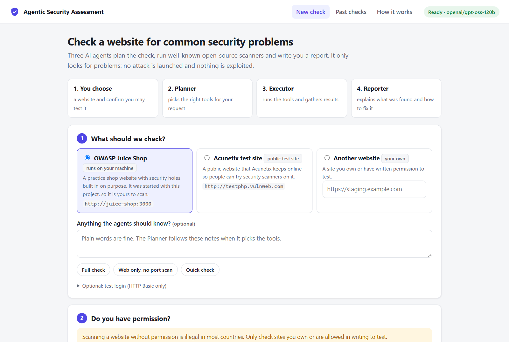

There are three choices: the local practice shop (the default), a public test site, or a website of your own. The notes box is where you tell the agents, in normal words, what you want. The three small buttons fill in common requests. This demo uses **Full check**.

## Step 2. No tick, no scan

The start button stays disabled until the permission box is ticked. The hint beside it says why.

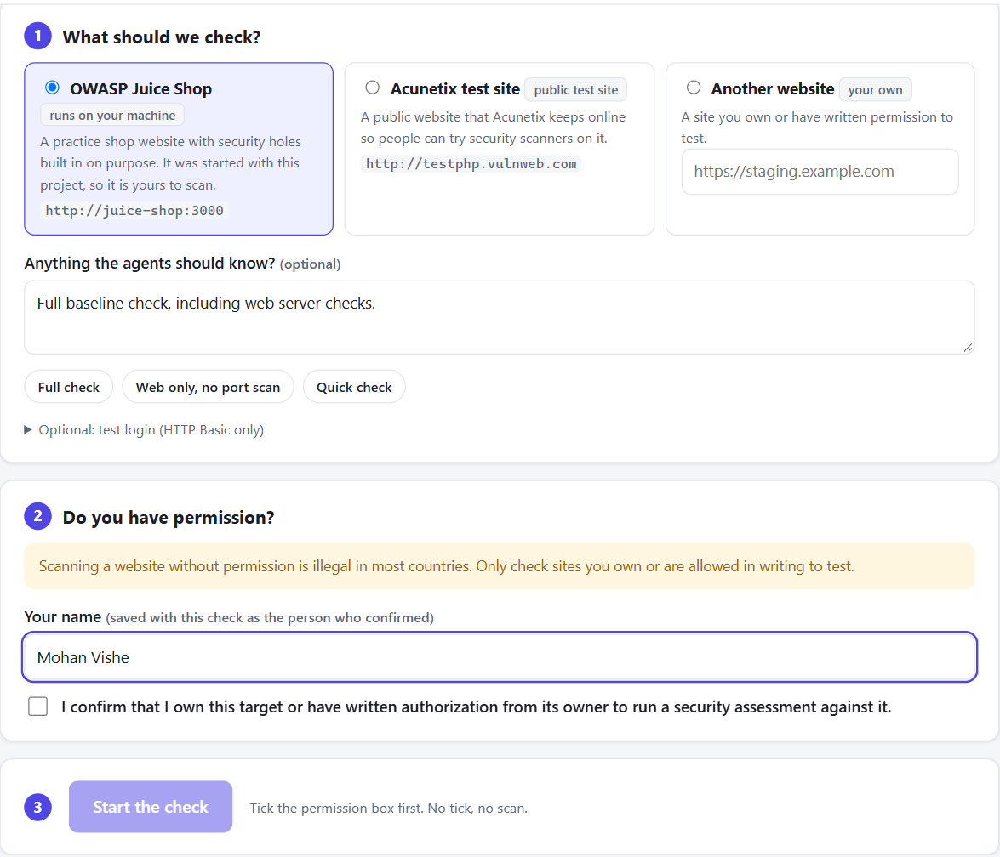

After the name is filled in and the box is ticked, the button becomes active:

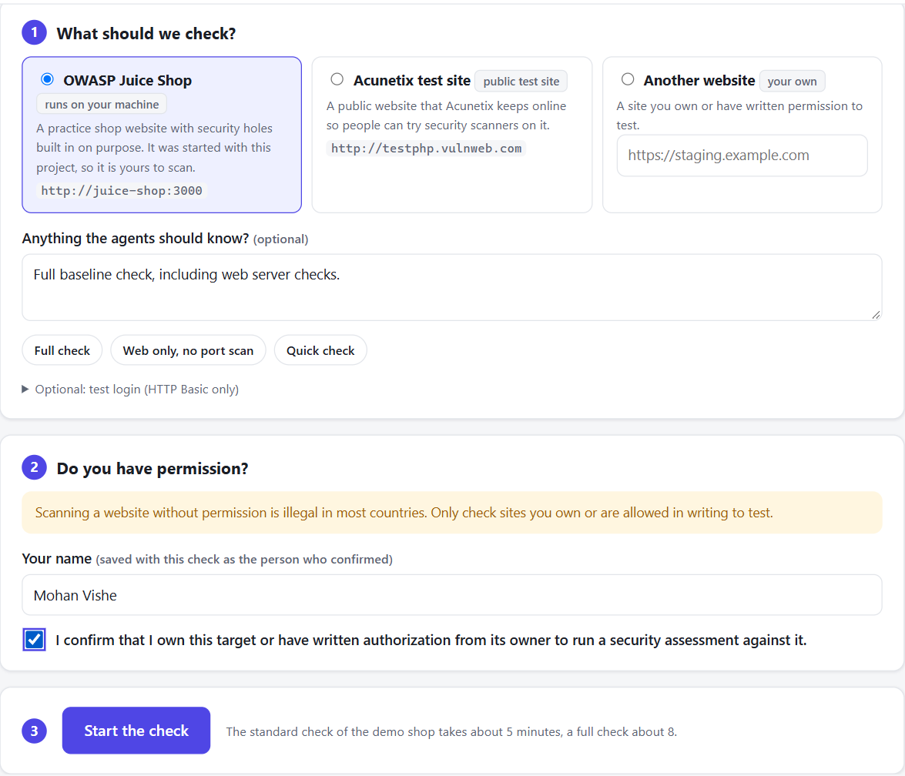

The confirmation is saved with the check: who confirmed, when, and the exact sentence. This is not only a rule of the web page. The server answers "403 Forbidden" if a check is started without it, and the scanner service asks the server again before every tool.

## Step 3. Watch the agents work

Pressing **Start the check** hands the request to the three agents. The page updates by itself.

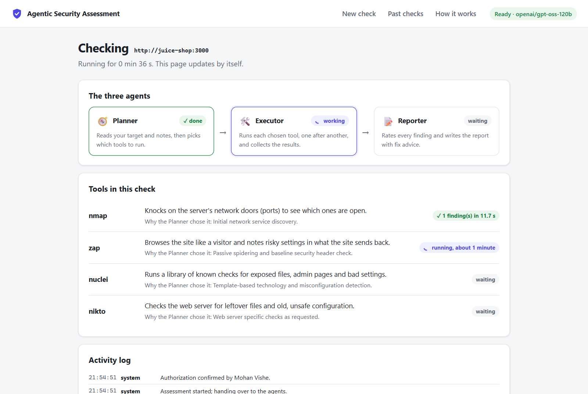

What the screenshot shows, 36 seconds into the run:

- The **Planner** has finished. It took about one second.
- The **Executor** is working. nmap is done, ZAP is running, Nuclei and Nikto are waiting.
- The **Reporter** is waiting for the results.
- Under each tool is the Planner's own reason for choosing it.

## Step 4. What the agents decided, and why

### The Planner's decision

The Planner received three things: the target address, the notes, and a list of the tools that exist (name, what each does, how long it takes). It answered with this plan:

| Order | Tool | The Planner's reason (its own words) |
|---|---|---|
| 1 | nmap | "Initial network service discovery." |
| 2 | zap | "Passive spidering and baseline security header check." |
| 3 | nuclei | "Template-based technology and misconfiguration detection." |
| 4 | nikto | "Web server specific checks as requested." |

Its note on the plan: *"Scope requested a full baseline and web server checks, so all tools including nikto were included."*

Nikto is noisy, so the Planner's instructions say to add it only when someone asks for a full or thorough check or for web server checks. Here the notes asked for exactly that. With different notes the plan changes:

**"Web application checks only. Do not port scan."** (run with `qwen/qwen3.8-27b`)

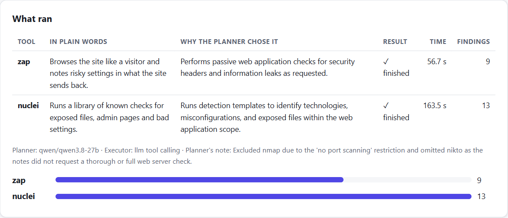

The Planner left nmap out, and explained: *"Excluded nmap due to the 'no port scanning' restriction and omitted nikto as the notes did not request a thorough or full web server check."*

**"Only check which ports are open. No web scanning."** (run with `openai/gpt-oss-20b`)

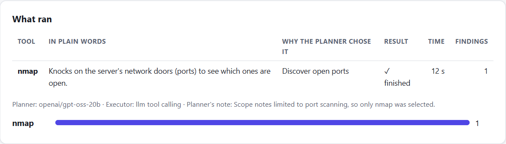

Only nmap ran. The whole check took 20 seconds.

More examples, including a prompt-injection attempt and a request for tools that do not exist, are in the [Planner test results](../evals/results.md).

### The Executor's decisions

The Executor received the plan and four functions it could call: `run_nmap`, `run_zap`, `run_nuclei`, `run_nikto`. None of them takes a web address. The scanner service looks up the target from the saved, authorized check, so the AI cannot point a scanner somewhere else.

It called them in the planned order. After each tool it read a short summary (status, number of findings, a few titles, whether the target still answers) and decided to continue. It would have stopped if a summary had said the target went down.

### The Reporter's decisions

First, code copied all 33 findings from the tool results into the report and gave each a severity based on the scanner's own rating. Then the AI was shown the finding IDs, titles and severities and asked for three things: a summary, what to fix first, and how to fix each important finding. It grouped related findings under one action, for example two ZAP findings about missing headers under "add the missing security headers".

## Step 5. The report

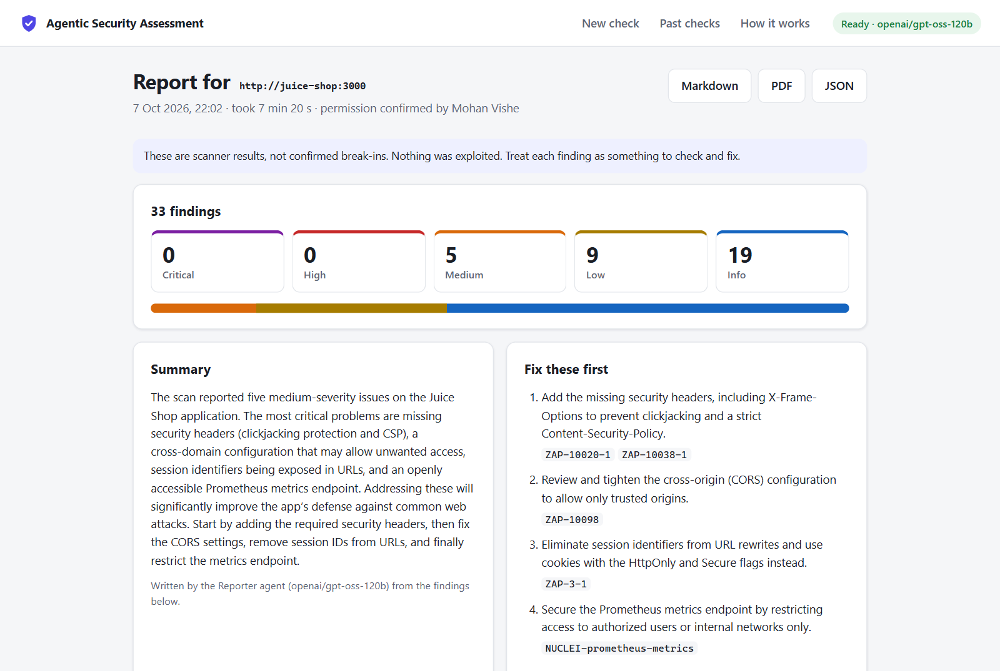

The top of the report has the numbers, a summary in plain language and the "fix these first" list. Each action lists the findings it would solve. ([See the whole page as one image](demo/05-report-full.png).)

**What ran** shows each tool, why it was chosen, how long it took and what it produced. Nikto was stopped at its time limit, and the report says so:

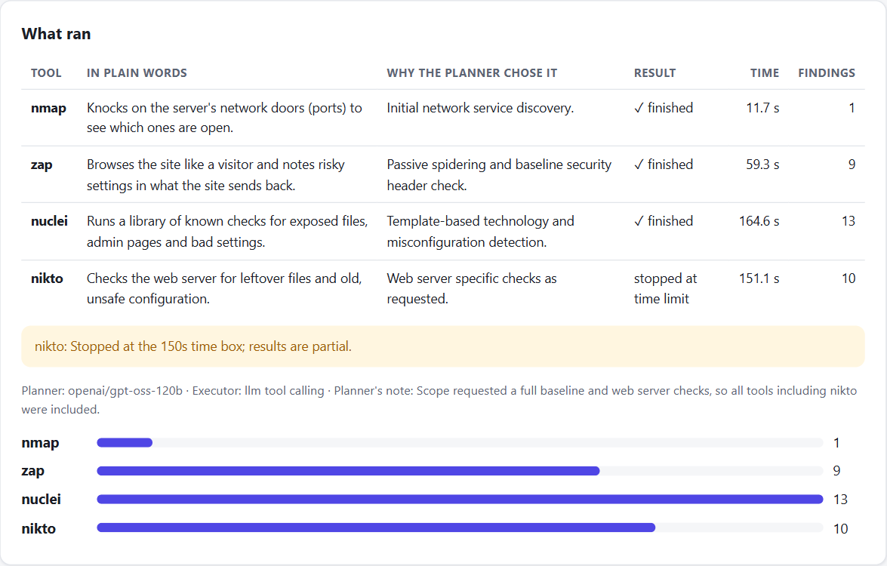

**Findings** come as one card each. Opening a card shows why it has that severity, where it was seen, the scanner's evidence, how to fix it, and a link to the scanner's untouched output:

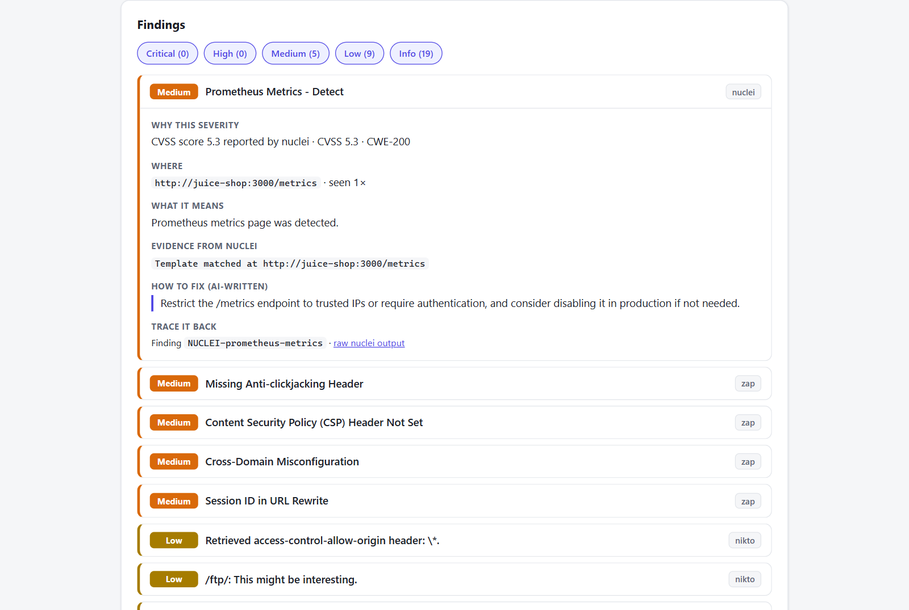

### What was found on Juice Shop

| Severity | Finding | Found by |
|---|---|---|
| Medium | A Prometheus metrics page is open to everyone (`/metrics`) | Nuclei |
| Medium | No anti-clickjacking header | ZAP |
| Medium | No Content Security Policy header | ZAP |
| Medium | Cross-domain (CORS) setting allows any website | ZAP |
| Medium | Session ID appears in web addresses | ZAP |
| Low | An `/ftp/` folder that answers requests, and a `robots.txt` that points to it | Nikto |
| Low | Missing `X-Content-Type-Options` header, timestamps and a private IP address in responses | ZAP |
| Info | Open port 3000, technology fingerprints, a public Swagger API page, missing optional headers | nmap, Nuclei |

Juice Shop is famous for much more serious holes (SQL injection, broken login and so on). They are not in this list, and that is expected: finding them means sending attack input, which this tool does not do on purpose. The report says this itself under "What was not tested".

### A false alarm, caught

Juice Shop answers *every* address with its home page. That fools Nikto into reporting files such as `/.htpasswd` (a password file) that do not exist. The tool checks each such address against a made-up one. When both return the same page, the finding is moved down to Info and labelled:

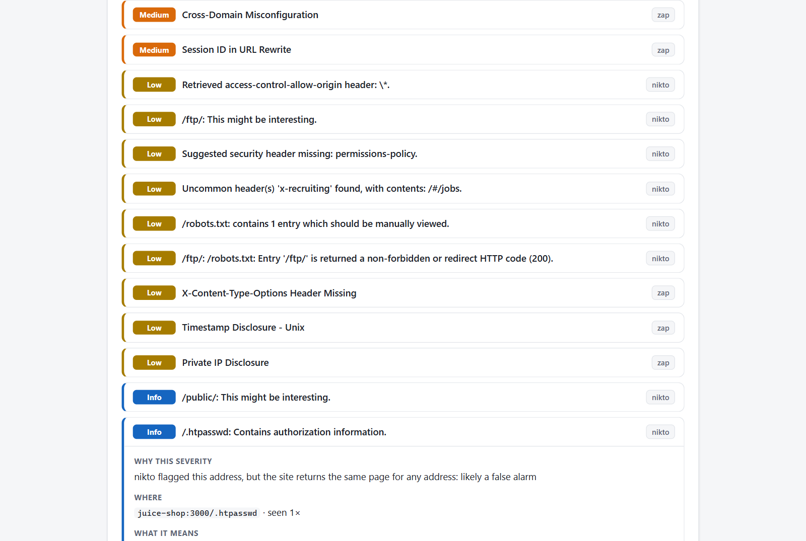

Without this check the "fix these first" list contained advice to remove password files that were never there.

## Step 6. Was the run any good? Quality checks

After the agents finish, code checks the report. A full green bar is a full pass.

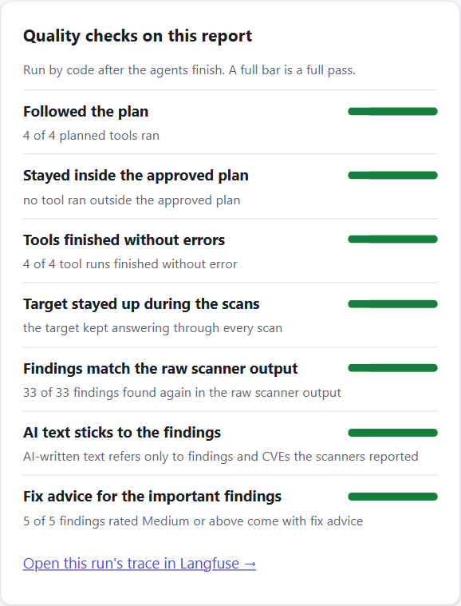

The most important one is **"Findings match the raw scanner output"**: each of the 33 findings was looked up again in the file the scanner itself wrote. An invented finding would fail this check.

## Step 7. Look inside the agents

### The flow in Langflow

http://localhost:7860 shows the three agents as boxes on a canvas. Each has its instructions in a text field that can be edited there.

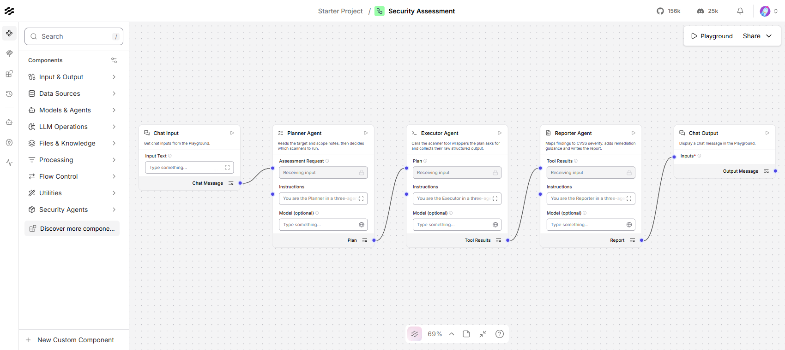

### The trace in Langfuse

With Langfuse switched on, the whole run is recorded as one trace. The tree on the left reads top to bottom: the Planner with its one question to the AI model, the Executor alternating between the AI model and the four scanner runs, and the Reporter with its one question. Each line shows how long it took and how many tokens it used.

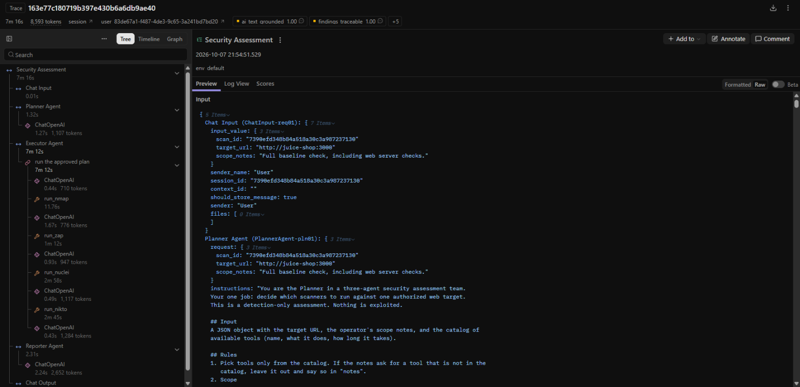

The quality checks from step 6 are attached to the same trace as scores, so runs can be compared over time:

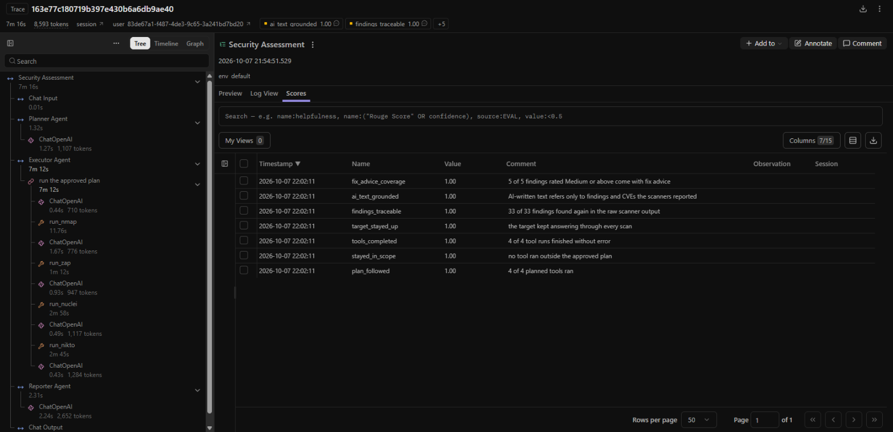

## Step 8. The same check on other models

The same pipeline was run with the other models available on Groq's free tier.

| Model | Notes given | Tools chosen | Findings | Quality checks |
|---|---|---|---|---|
| `openai/gpt-oss-120b` | Full baseline check, including web server checks. | nmap, zap, nuclei, nikto | 33 | all 1.0 |
| `qwen/qwen3.8-27b` | Web application checks only. Do not port scan. | zap, nuclei | 22 | all 1.0 |
| `openai/gpt-oss-20b` | Only check which ports are open. No web scanning. | nmap | 1 | all 1.0 |
| `openai/gpt-oss-20b` | Web application checks only. Do not port scan. | zap, nuclei | 21 | all 1.0 |

All three models also pass the 12-case Planner test set ([results](../evals/results.md)).

## Try it yourself

```bash
git clone https://github.com/MohanVishe/agentic-security-assessment.git
cd agentic-security-assessment
cp .env.example .env          # then paste your free Groq key after LLM_API_KEY=
docker compose up -d --build
```

Open http://localhost:8000 and follow the three steps on the page. The [README](../README.md#3-quick-start) has the details.
